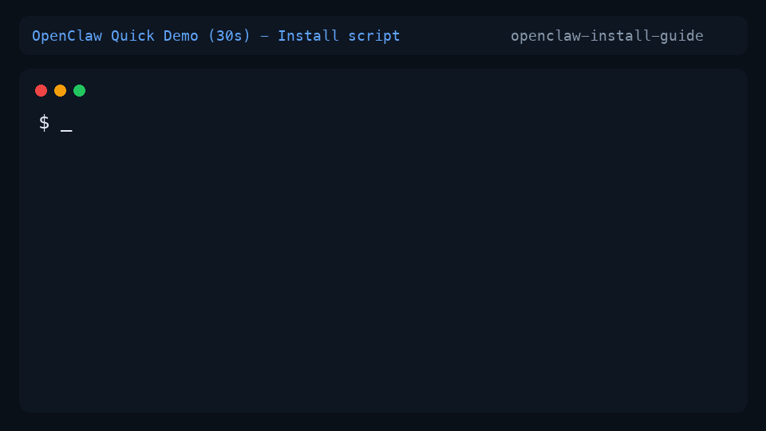

[English](README_EN.md) | **简体中文**

<div align="center">

# OpenClaw 安装教程

**10 分钟完成 OpenClaw 安装 + PipeLLM(Claude/GPT/Gemini) 接入**

[](https://github.com/AIPMAndy/openclaw-install-guide/stargazers)
[](LICENSE)
[](#)



</div>

## 邀请链接

- PipeLLM 注册邀请链接：
  https://code.pipellm.ai/login?ref=t40e1qql
- 使用文档：https://code.pipellm.ai/dashboard

## 这份教程解决什么问题

| 对比项 | 官方文档 | 这份教程 |
|---|---|---|
| 系统覆盖 | 分散 | `MacOS/Linux + Windows` 一次讲清 |
| 初始化流程 | 描述较抽象 | 给出推荐选项和避坑 |
| 模型接入 | 需要自行整理 | 直接给可复制的 `models` 配置 |
| 验证步骤 | 需要自行摸索 | 提供最短验证命令路径 |

## 30 秒快速开始

### MacOS/Linux

```bash
curl -fsSL https://openclaw.ai/install.sh | bash
openclaw onboard --install-daemon
```

### Windows (PowerShell)

```powershell
iwr -useb https://openclaw.ai/install.ps1 | iex
openclaw onboard
```

## 目录

- [官方地址](#官方地址)
- [安装步骤](#安装步骤)
- [初始化推荐选项](#初始化推荐选项)
- [为什么这里用中转站](#为什么这里用中转站)
- [配置 PipeLLM Provider](#配置-pipellm-provider)
- [重启并验证](#重启并验证)
- [Telegram 机器人接入可选](#telegram-机器人接入可选)
- [发布文案包](#发布文案包)
- [常见问题](#常见问题)
- [原始教程来源](#原始教程来源)

## 官方地址

- OpenClaw 官网：https://openclaw.ai/
- OpenClaw 项目：https://github.com/openclaw/openclaw

## 安装步骤

### MacOS/Linux

```bash
curl -fsSL https://openclaw.ai/install.sh | bash
openclaw onboard --install-daemon
```

### Windows

```powershell
iwr -useb https://openclaw.ai/install.ps1 | iex
openclaw onboard
```

## 初始化推荐选项

执行 `openclaw onboard` 期间，建议按下列方式选择：

- 风险提示：`yes`
- 安装模式：`快速安装`
- 模型配置：先 `跳过`
- Provider 筛选：可先选 `Google`
- 机器人配置：先 `跳过`
- skills 包：`yes`
- skills 安装方式：`pnpm`
- skills 的模型 key：先全部 `No`

## 为什么这里用中转站

本教程里的 PipeLLM，本质上是一个模型 API 中转层（relay/proxy），不是模型本体。

使用中转站的核心原因：

- 可用性：某些地区或网络环境下，直连原厂接口不稳定，中转层通常更稳。
- 统一接入：用一套配置同时接 `Claude/GPT/Gemini`，减少多供应商对接成本。
- 切换效率：从一个模型切到另一个模型，只改 provider/model，不用重写整套流程。
- 运维效率：在网关和 key 管理上更集中，便于排查问题。

你需要明确的代价/风险：

- 数据与信任边界：请求会经过第三方中转，必须确认其日志策略和隐私条款。
- 成本结构：中转服务可能有额外加价或限流策略。
- 供应商依赖：中转层故障会影响可用性，需要预案。

什么时候建议不用中转站：

- 你所在环境可以稳定直连原厂 API，且不需要多模型统一接入。
- 你的组织有严格合规要求，只允许直接对接模型厂商。

选中转站的最小检查清单：

- 是否明确声明“是否存日志、存多久、如何删除”。
- 是否支持 API Key 轮换和最小权限控制。
- 是否有可观察性（错误码、调用日志、限流提示）。
- 是否有回退方案（可快速切回直连或备用中转）。

## 配置 PipeLLM Provider

把 `config/pipellm.models.json` 的内容合并到你的 `openclaw.json` 里 `models.providers` 节点。

- MacOS/Linux 路径：`~/.openclaw/openclaw.json`
- Windows 路径：`C:\Users\你的用户名\.openclaw\openclaw.json`
- 配置文件模板：[`config/pipellm.models.json`](config/pipellm.models.json)

> 请把配置中的 `换成你的key` 改成你自己的真实 API Key。

## 重启并验证

### 重启网关

- MacOS/Linux：

```bash
openclaw gateway restart
```

- Windows：

```powershell
openclaw gateway
```

### 在网关聊天页验证

```text
/models
/models pipellm-claude
/model pipellm-claude/claude-opus-4-5-20251101
你好
```

如果模型能正常回复，即配置成功。

## Telegram 机器人接入（可选）

1. 在 Telegram 找 `BotFather`，执行 `/newbot` 获取 Bot Token。
2. 打开本地网关 `Config -> Channels -> Telegram Bot Token`，填入 Token。
3. 配置本地代理（示例：`http://127.0.0.1:7890`）。
4. 获取 Pairing code 后执行：

```bash
openclaw pairing approve telegram 你的配对code
```

5. 回到 Telegram 对话机器人，验证联通性。

## 发布文案包

- 已提供可直接使用的中英文推广文案：
  [`docs/launch-copy.md`](docs/launch-copy.md)
- 覆盖平台：`X`、`Reddit`、`Hacker News`

## 常见问题

### 1. `/models` 看不到 PipeLLM provider

- 检查 `openclaw.json` 结构是否正确（尤其是 `models.providers` 层级）。
- 检查 `apiKey` 是否已替换。
- 检查是否重启网关。

### 2. 能看到 provider 但模型调用失败

- 检查网络代理配置。
- 检查 provider 的 `api` 字段是否与模板一致。
- 检查模型 id 是否拼写正确。

### 3. Windows 下命令执行后没有效果

- 确认在 `PowerShell` 中执行，而不是 CMD。
- 尝试使用管理员权限重新执行。

## 原始教程来源

- MacOS/Linux：
  https://furbox.yuque.com/org-wiki-furbox-spmbkw/oishf7/lpqfodgg3qwhxbsa
- Windows：
  https://furbox.yuque.com/org-wiki-furbox-spmbkw/oishf7/lzsgqkrtgit6eo17

---

如果这份教程对你有帮助，欢迎点个 Star：
https://github.com/AIPMAndy/openclaw-install-guide
